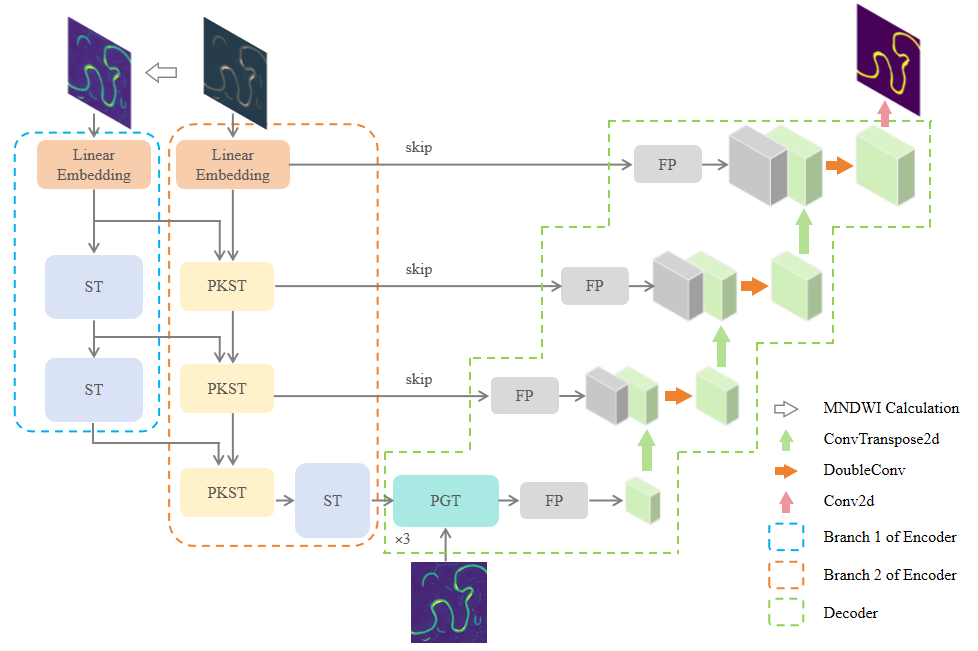

# MigSwinUNet

## What is this repository for?

MigSwinUNet is the official code implementation for the paper **"Analysis of Meandering River Migration Patterns Using Remote Sensing Semantic Segmentation"**.

This repository provides a deep learning framework for river semantic segmentation based on remote sensing imagery, with a focus on identifying meandering river boundaries and supporting the analysis of river migration patterns.

---

## Research Objectives

The main purpose of this project is to support the study of **meandering river migration** through **remote sensing semantic segmentation**. Specifically, this repository aims to:

1. **Accurately extract river channels from remote sensing images**  
   By using semantic segmentation methods, the model can identify river regions from complex surface backgrounds.

2. **Improve the efficiency of river morphology analysis**  
   Traditional manual delineation is time-consuming and subjective. This project provides an automated solution for river extraction and interpretation.

3. **Support migration pattern analysis of meandering rivers**  
   High-quality river segmentation results can provide a reliable basis for further research on river channel migration, bank erosion, channel evolution, and geomorphological change.

4. **Provide a reproducible deep learning workflow for fluvial geomorphology research**  
   The repository can serve as a reference framework for applying computer vision methods to geomorphological and remote sensing studies.

---

## Scope

This project is mainly applicable to the following scenarios:

1. **Semantic segmentation of meandering rivers in remote sensing imagery**
2. **River boundary extraction and channel identification**
3. **Monitoring and analysis of river migration and channel evolution**
4. **Research in fluvial geomorphology, remote sensing interpretation, and geographic information analysis**
5. **Methodological reference for deep learning-based water body extraction tasks**

### Notes on applicability

- This repository is primarily designed for **meandering river systems**.
- It is suitable for **remote sensing image interpretation and segmentation tasks** where river channel features are distinguishable.
- For other types of rivers, regions, or datasets, model performance may vary, and further fine-tuning or adaptation may be required.

---

## Who do I talk to?

**Yu Sun**  
a. School of Earth Sciences, Northeast Petroleum University, Daqing 163318, China  
b. National Key Laboratory of Continental Shale Oil, Northeast Petroleum University, Daqing, Heilongjiang 163318, China  

**E-mail:** sunyu_hc@163.com

---

## Usage

1. Download the **MeanderSeg** dataset from:  
   https://doi.org/10.5281/zenodo.15869836

2. Place the downloaded images and labels into the following folders, respectively:  
   - `data/imgs`
   - `data/masks`

3. Set the hyperparameters in `setting.py`.

4. Run `train.py` to train the **MigSwinUNet** model.

5. Run `test.py` to evaluate the segmentation performance of the trained model.

---

## Project Structure

1. **`network.py`**  
   Defines the architecture of the **MigSwinUNet** model.

2. **`train.py`**  
   Training script for model training.

3. **`setting.py`**  
   Contains configurable hyperparameters and training settings.

4. **`data_set.py`**  
   Implements the dataset loader for training and testing.

5. **`focal_loss.py`**  
   Implementation of the focal loss function.

6. **`utils.py`**  
   Utility functions, including model weight initialization.

7. **`test.py`**  
   Script for evaluating the trained model on test data.

8. **`data/`**  
   - `data/imgs`: Remote sensing images used for training  
   - `data/masks`: Corresponding semantic segmentation labels

---
